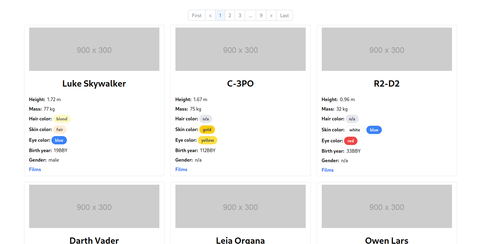
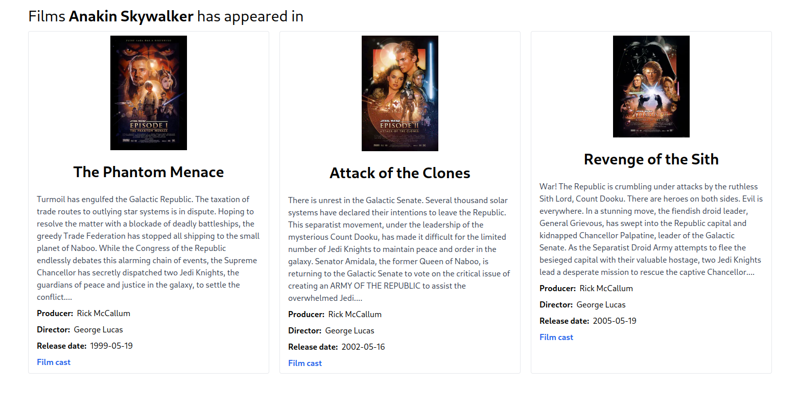
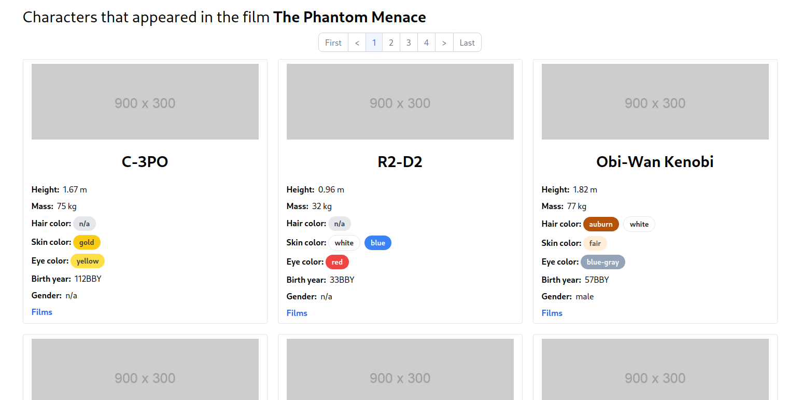

# A simple SWAPI client

## NextJs

### Static site generation (SSG) e Incremental site regeneration (ISR)

Debido a que la información de la API no cambia, se consideró que sería buena
idea generar toda la página de forma estática. Sin embargo, se dieron los
siguientes inconvenientes:

- La página retorna los resultados paginados y, aunque es posible saber el
  número total de páginas, no se consideró buena idea tratar de generar todas
  las páginas `at build time`. Para este caso solamente se tienen 9 páginas,
  pero se quiso "considerar" que este número de páginas es muy grande.

- Cuando se generan las páginas de forma estática es necesario que la ruta de
  dicha página sea "estática"; es decir, las rutas de paginación para los
  personajes deben estar de la forma `/characters/3` y no de la
  forma `/characters?page=3`, puesto que no es posible generar páginas estáticas
  utilizando `query params`. Esto implica que la paginación queda un poco "fuera
  de lo convencional" (al menos desde mi perspectiva).

- También se tiene ganas de hacer uso de la funcionalidad SSR de NextJs.

Considerando las observaciones anteriores se determinó lo siguiente

- Las primeras 5 páginas de los personajes están generadas de forma estática.

- Las últimas 4 páginas se generan "on demand" y se cachean cuando se acceden
  por primera vez. Dicho cache tiene una duración de 1 día. A esta funcionalidad
  se le conoce como ISR en NextJs.

- Todas las páginas restantes serán generadas usando SSR.

### Server side rendering (SSR)

Con el objetivo de jugar con esta funcionalidad en NextJs, a página de `Films` y
`Cast` son generadas en el lado del servidor.

Observaciones

- La página de Films hace uso de imágenes con el objetivo de demostrar que
  NextJs las optimiza de manera automática (Les hace `resize` y las convierte a
  un formato `WebP`).

## Deploy a Vercel con Github Actions

### ¿Por qué se hizo el deploy a Vercel desde Github Actions y no con la consola de Vercel?

Se hizo el deploy de esta forma para tener más control de la forma en el que se
ejecutan los tests y se construye en proyecto. Vercel provee
ciertos [Checks](https://vercel.com/docs/integrations/checks-overview) que
pueden ejecutarse cuando se hace un deploy; sin embargo, no se encontró una
manera sencilla de correr simples `unit tests` antes de que se hiciera un
deploy.

De esta forma, si alguno de los `tests` falla ya no se procede con el deploy a
Vercel.

Además, se tuvo el interés de jugar un rato con Github actions para conocer con
más claridad su funcionamiento.

## Mejoras

### Caching

Si no me equivoco, la API hace uso del
principio [HATEOAS](https://www.baeldung.com/spring-hateoas-tutorial#:~:text=The%20Spring%20HATEOAS%20project%20is,the%20Engine%20of%20Application%20State)
porque para ir de un recurso a otro se hace uso de `links`. El detalle que tiene
este diseño es que provoca la proliferación de peticiones para seguir
dichos `links` y obtener los recursos. Sería ideal añadir algún mecanismo
de `caching` o paralelización para recuperar los recursos de manera más
eficiente.

Se trató de utilizar las siguientes librerías para consumir la API (sin éxito):

- [traverson](https://github.com/traverson/traverson): No tiene la funcionalidad
  de poder recuperar los recursos a partir de un array de `links`.

- [ketting](https://github.com/badgateway/ketting): Esta librería
  funciona específicamente con APIS que siguen el formato **HAL**, **JSON:
  API**, **Siren** o **Collection+JSON** (Me parece que **SWAPI** no
  sigue un formato en particular).

Además, ambas librerías trabajaban con la API `fetch`, sin la posibilidad de
poder utilizar `axios`.

## Imágenes

### Personajes (página 1)

### Films

### Cast (personajes que aparecieron en una película)

